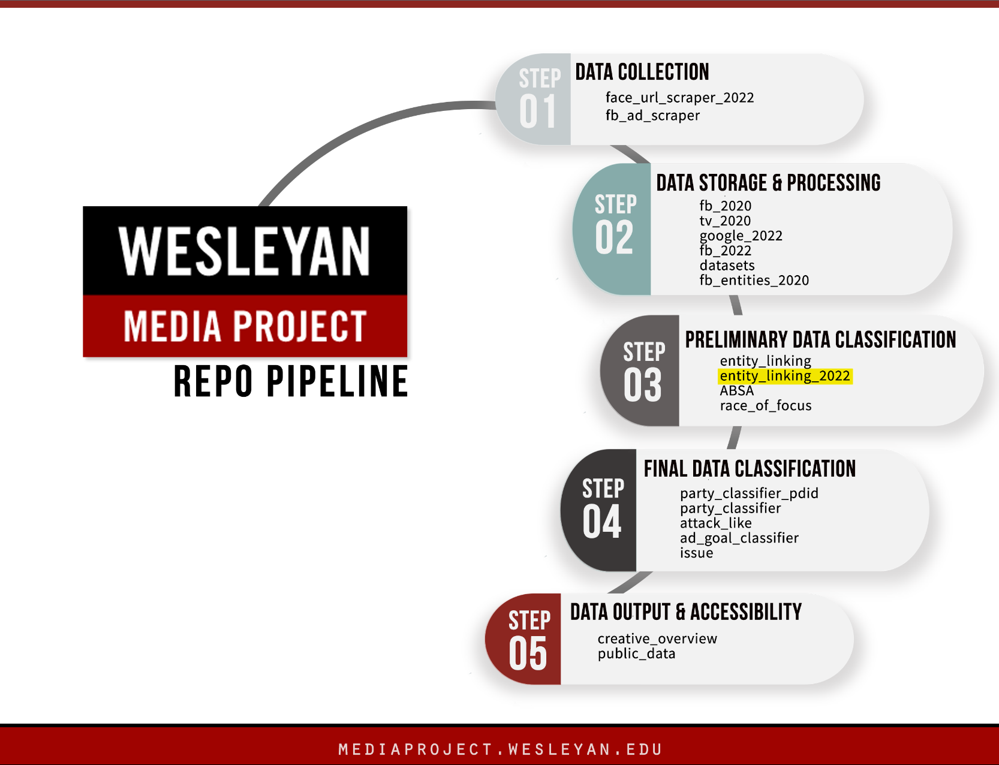

# Wesleyan Media Project - Entity Linking 2022

Welcome! This repo is a part of the Cross-platform Election Advertising Transparency initiative ([CREATIVE](https://www.creativewmp.com/)) project. CREATIVE is a joint infrastructure project of WMP and privacy-tech-lab at Wesleyan University. CREATIVE provides cross-platform integration and standardization of political ads collected from Google and Facebook. You will also need the repos [datasets](https://github.com/Wesleyan-Media-Project/datasets) and [data-post-production](https://github.com/Wesleyan-Media-Project/data-post-production) to run the knowledge base creation script.

This repo is a part of the Preliminary Data Classification step.

## Table of Contents

- [Introduction](#introduction)
- [Objective](#objective)
- [Data](#data)

- [Setup](#setup)

## Introduction

This repository is an entity linker for 2022 election data. This entity linker was trained on data that contains descriptions of people and their names, along with their aliases. Data are sourced from the 2022 WMP persons file, and are restricted to general election candidates and other non-candidate persons of interest (sitting senators, cabinet members, international leaders, etc.)

First we construct a knowledge base of persons of interest in `facebook/train/01_construct_kb.R`. The people for that are sourced from the 2022 WMP persons file, and are restricted to general election candidates and other non-candidate persons of interest (sitting senators, cabinet members, international leaders, etc.). In the same script, we construct one sentence for each person with a basic description. Districts and party are sourced from the 2022 WMP candidates file.

Then we initialize an entity linker with spaCy in `facebook/train/02_train_entity_linking.py`.

Finally, on the inference data, we apply this entity linker, including some additional modifications to deal with the multiple Harrises etc. problem.

## Objective

Each of our repos belongs to one or more of the following categories:

- Data Collection
- Data Storage & Processing
- Preliminary Data Classification
- Final Data Classification

This repo is part of the Preliminary Data Classification section.

## Data

The entity linking results are stored in the `data` folder and they are in `csv.gz` and `csv` format.

## Setup

The scripts are numbered in the order in which they should be run. Scripts that directly depend on one another are ordered sequentially. Scripts with the same number are alternatives, usually they are the same scripts on different data, or with minor variations. The outputs of each script are saved, so it is possible to, for example, only run the inference script, since the model files are already present.

There are separate folders for Facebook and Google. Within Facebook, the code needs to be run in the order of knowledge base, training, and then inference.

Some scripts require datasets from the [datasets](https://github.com/Wesleyan-Media-Project/datasets) repo (which contains datasets that aren't created in any of the repos and intended to be used in more than one repo) and tables from the [data-post-production](https://github.com/Wesleyan-Media-Project/data-post-production) repo. 

Those repos are assumed to be cloned into the same top-level folder as the entity_linking_2022 repo.

**Note:** "Some scripts operate in a Python environment and need the following packages: `spacy` version 3.2.4 and `en_core_web_lg` from `spacy`. This repo is tried on python 3.10. We recommend creating a Python virtual environment by using Anaconda to run the scripts in this repo. 

 `en_core_web_lg` requires manual installation, which can be done by running the following command in the terminal:
`python -m spacy download en_core_web_lg`
