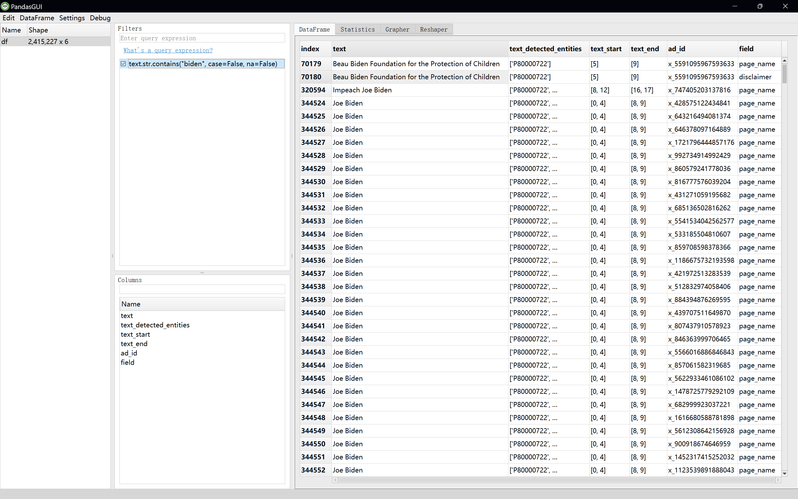

# Wesleyan Media Project - Entity Linking 2022

NOTE: This repo is for usability study purposes only. The main Entity Linking repo is here: https://github.com/Wesleyan-Media-Project/entity_linking_2022.

Welcome! This repo contains scripts for identifying and linking election candidates and other political entities in political ads on Google and Facebook. The scripts provided here are intended to help journalists, academic researchers, and others interested in the democratic process to understand which political entities are connected and how.

This repo is a part of the [Cross-platform Election Advertising Transparency Initiative (CREATIVE)](https://www.creativewmp.com/). CREATIVE is an academic research project that has the goal of providing the public with analysis tools for more transparency of political ads across online platforms. In particular, CREATIVE provides cross-platform integration and standardization of political ads collected from Google and Facebook. CREATIVE is a joint project of the [Wesleyan Media Project (WMP)](https://mediaproject.wesleyan.edu/) and the [privacy-tech-lab](https://privacytechlab.org/) at [Wesleyan University](https://www.wesleyan.edu).

To analyze the different dimensions of political ad transparency we have developed an analysis pipeline. The scripts in this repo are part of the Data Classification Step in our pipeline.


## Table of Contents

[1. Video Tutorial](#1-video-tutorial)  
[2. Overview](#2-overview)  
[3. How to Run the Scripts](#3-how-to-run-the-scripts)  
[4. Results Storage](#4-results-storage)  
[5. Results Analysis](#5-results-analysis)  
[6. Thank You](#6-thank-you)

## 1. Video Tutorial

<video src="https://github.com/Wesleyan-Media-Project/entity_linking_2022/assets/104949958/2a7f456f-d2d9-439f-8e64-f9abb589069e" alt="If you are unable to see the video on Firefox with the error: No video with supported format and MIME type found, please try it on Chrome.">
</video>

If you are unable to see the video above (e.g., you are getting the error "No video with supported format and MIME type found"), try a different browser. The video works on Google Chrome.

Or, you can also watch this tutorial through [YouTube](https://youtu.be/-C29ZL3snxM).

## 2. Overview

This repo contains an entity linker for 2022 election data. The entity linker is a machine learning classifier and was trained on data that contains descriptions of people and their names, along with their aliases. Data are sourced from the 2022 WMP [person_2022.csv](https://github.com/Wesleyan-Media-Project/datasets/blob/main/people/person_2022.csv) and [wmpcand_120223_wmpid.csv](https://github.com/Wesleyan-Media-Project/datasets/blob/main/candidates/wmpcand_120223_wmpid.csv) --- two comprehensive files with names of candidates and other people in the political process. Data are restricted to general election candidates and other non-candidate people of interest (sitting senators, cabinet members, international leaders, etc.).

While this repo applies the trained entity linker to the 2022 US elections ads, you can also apply our entity linker to analyze your own political ad text datasets to identify which people of interest are mentioned in ads. The entity linker is especially useful if you have a large amount of ad text data and you do not want to waste time counting how many times a political figure is mentioned within these ads. You can follow the setup instructions below to apply the entity linker to your own data.

There are separate folders for running the entity linker depending on whether you want to run it on Facebook or Google data. For both Facebook and Google, the scripts need to be run in the order of three tasks: (1) constructing a knowledge base of political entities, (2) training the entity linking model, and (3) making inferences with the trained model. The repo provides reusable code for these three tasks. For your overview, we describe the three tasks in the following. Note that we provide a knowledge base and pre-trained models that are ready for your use on Google and Facebook 2022 data. For this data you can start right away making inferences and skip steps 1 and 2. However, if you want to apply our inference scripts to a different time period (for example, another election cycle) or in a different context (for example, a non-U.S. election), then you would need to create your own knowledge base and train your own models.

1. **Constructing a Knowledge Base of Political Entities**

   The first task is to construct a knowledge base of political entities (people) of interest.

   The knowledge base of people of interest is constructed from [facebook/knowledge_base/01_construct_kb.R](https://github.com/Wesleyan-Media-Project/entity_linking_2022/blob/main/facebook/knowledge_base/01_construct_kb.R). The input to the file is the data sourced from the 2022 WMP persons file [person_2022.csv](https://github.com/Wesleyan-Media-Project/datasets/blob/main/people/person_2022.csv). The script constructs one sentence for each person with a basic description. Districts and party are sourced from the 2022 WMP candidates file [wmpcand_120223_wmpid.csv](https://github.com/Wesleyan-Media-Project/datasets/blob/main/candidates/wmpcand_120223_wmpid.csv), a comprehensive file with names of candidates.

   The knowledge base has four columns that include entities' `id`, `name`, `descr` (for description), and `aliases`. Examples of aliases include Joseph R. Biden being referred to as Joe or Robert Francis O’Rourke generally being known as Beto O’Rourke. Here is an example of one row in the knowledge base:

   | id        | name      | descr                                                                    | aliases                                                             |
   | --------- | --------- | ------------------------------------------------------------------------ | ------------------------------------------------------------------- |
   | WMPID1770 | Adam Gray | Adam Gray is a Democratic candidate for the 13rd District of California. | Adam Gray,Gray,Adam Gray's,Gray's,ADAM GRAY,GRAY,ADAM GRAY'S,GRAY'S |

2. **Training the Entity Linking Model**

   The second task is to train an entity linking model using the knowledge base.

   Once the knowledge base of people of interest is constructed, the entity linker can be initialized with [spaCy](https://spacy.io/), a natural language processing library we use, in [facebook/train/02_train_entity_linking.py](https://github.com/Wesleyan-Media-Project/entity_linking_2022/blob/main/facebook/train/02_train_entity_linking.py).

   After successfully running the above scripts in the training folder, you should see the following trained model in the `models` folder:

   - `intermediate_kb`
   - `trained_entity_linker`

3. **Making Inferences with the Trained Model**

   The third task is to make inferences with the trained model to automatically identify and link entities mentioned in new political ad text.

   To perform this task you can use the scripts in the inferences folders, [facebook/inference](https://github.com/Wesleyan-Media-Project/entity_linking_2022/tree/main/facebook/inference) and [google/inference](https://github.com/Wesleyan-Media-Project/entity_linking_2022/tree/main/google/inference). The folders incluced variations of scripts to disambiguate people, for example, multiple "Harrises" (e.g., Kamala Harris and Andy Harris).

## 3. How to Run the Scripts

**Note**: You can **skip** steps [1 (Constructing a Knowledge Base of Political Entities)](#1-constructing-a-knowledge-base-of-political-entities) and [2 (Training the Entity Linking Model)](#2-training-the-entity-linking-model) if you decide to instead use our own knowledge base and **pre-trained entity linker model**. Our knowledge base ([`entity_kb.csv`](https://github.com/Wesleyan-Media-Project/entity_linking_2022_usabilitystudy/blob/main/facebook/data/entity_kb.csv)) is already conveniently located within the repository, but you'll need to download the pre-trained entity linker manually. The model is hosted on our Figshare, which you can access by following [this link](https://www.creativewmp.com/data-access/) and completing the Data Access Form. This will immediately redirect you to a page from which you can download the model!

### 0. Cloning the entity_linking_2022_usabilitystudy Repository

In order to run the scripts in this repository, you'll need to copy them onto your own computer. To do so:

#### If you use macOS/Linux:

1. Open up your Terminal application, which is located in `Applications/Utilities` on a Mac.

2. Execute the following command in order to clone this repository onto your computer, in your home directory:

   ```bash
   git clone https://github.com/Wesleyan-Media-Project/entity_linking_2022_usabilitystudy.git
   ```

#### If you use Windows:

1. Click the Start Menu, search for the Powershell application, and select **Windows Powershell** in order to open up the Powershell application.

2. Execute the following command in order to clone this repository onto your computer, in your home directory:

   ```bash
   git clone https://github.com/Wesleyan-Media-Project/entity_linking_2022_usabilitystudy.git
   ```

### 1. Constructing a Knowledge Base of Political Entities

To completely set your computer up for, as well as run, the `facebook/knowledge_base` script, you can use the `setup_kb` scripts we prvoide!

#### If you use macOS/Linux:

1. If you haven't already, make sure you have Python 3.10.5 and R both installed on your computer. [Here](https://www.python.org/ftp/python/3.10.5/python-3.10.5-macos11.pkg) is a direct link to the Python 3.10.5 package for macOS, and [here](https://cran.r-project.org/bin/macosx/) is a direct link to the R package for macOS. After downloading, open each and follow the prompts. **Don't forget to check the box that adds each package to your PATH during installation!**

   If you need further documentation, you can visit the main [Python](https://www.python.org/downloads/release/python-3105/) and [R](https://cran.r-project.org) sites.

2. Execute the following two commands in order to set up and run `facebook/knowledge_base/01_construct_kb.R`:

   ```bash
   chmod +x ./entity_linking_2022_usabilitystudy/setup_kb.sh
   ./entity_linking_2022_usabilitystudy/setup_kb.sh
   ```

#### If you use Windows:

1. If you haven't already, make sure you have Python 3.10.5 and R both installed on your computer. [Here](https://www.python.org/ftp/python/3.10.5/python-3.10.5-amd64.exe) is a direct link to the Python 3.10.5 package for Windows, and [here](https://cran.r-project.org/bin/windows/) is a direct link to the R package for Windows. After downloading, open each and follow the prompts. **Don't forget to check the box that adds each package to your PATH during installation!**

   If you need further documentation, you can visit the main [Python](https://www.python.org/downloads/release/python-3105/) and [R](https://cran.r-project.org) sites.

2. Execute the following two commands in order to set up and run `facebook/knowledge_base/01_construct_kb.R`:

   ```powershell
   Set-ExecutionPolicy RemoteSigned -Scope CurrentUser
   .\entity_linking_2022_usabilitystudy\setup_kb.ps1
   ```

**Note**: For more detailed documentation on how to manually complete this step, you can follow [this link](https://docs.google.com/document/d/1iwiGdOZ8xkXLDT-y9d0xdkRdcujgfJxyHg3CBUDNOEg/edit?usp=sharing).

### 2. Training the Entity Linking Model

To completely set your computer up for as well as run the `facebook/train` scripts, you can use the `setup_train` scripts we prvoide!

**Note**: Running the [`02_train_entity_linking.py`](https://github.com/Wesleyan-Media-Project/entity_linking_2022_usabilitystudy/blob/main/facebook/train/02_train_entity_linking.py) script in this step takes multiple hours to complete!

1. Running these scripts requires `fb_2022_adid_text.csv.gz` and `fb_2022_adid_text.csv.gz`, which are hosted on our Figshare. If you have not downloaded these datasets yet, you can do so by following [this link](https://www.creativewmp.com/data-access/) and completing the Data Access Form, which will redirect you to a page from which you can download both datasets. Please do not move the files from your **Downloads** folder!

#### If you use macOS/Linux:

2. Execute the following two commands in order to set up and run `facebook/train`:

   ```bash
   chmod +x ./entity_linking_2022_usabilitystudy/setup_train.sh
   ./entity_linking_2022_usabilitystudy/setup_train.sh
   ```

   **Note**: You may be prompted for your password. This just gives the script permission to move the datasets and trained entity linker model from your Downloads folder to the appropriate locations! You should use the same password that you use to log into your computer!

#### If you use Windows:

2. Execute the following two commands in order to set up and run `facebook/train`:

   ```powershell
   Set-ExecutionPolicy RemoteSigned -Scope CurrentUser
   .\entity_linking_2022_usabilitystudy\setup_train.ps1
   ```

   **Note**: You may be prompted for your password. This just gives the script permission to move the datasets and trained entity linker model from your Downloads folder to the appropriate locations! You should use the same password that you use to log into your computer!

**Note**: For more detailed documentation on how to manually complete this step, you can follow [this link](https://docs.google.com/document/d/11Wi66xhmrL4mo9NpH7C7n_Gbp4wX9YQL_gGbcYHL4kA/edit?usp=sharing).

### 3. Making Inferences with the Trained Model

To completely set your computer up for, as well as run, the `facebook/inference` scripts, you can use the `setup_inference` scripts we prvoide!

1. Running the `facebook/inference` scripts requires the `fb_2022_adid_text.csv.gz` dataset, and running the `google/inference` scripts requires the `g2022_adid_01062021_11082022_text.csv.gz` dataset, both of which are hosted on our Figshare. If you have not downloaded these datasets yet, you can do so by following [this link](https://www.creativewmp.com/data-access/) and completing the Data Access Form, which will redirect you to a page from which you can download both datasets. Please do not move the files from your **Downloads** folder!

2. If you skipped steps [1 (Constructing a Knowledge Base of Political Entities)](#1-constructing-a-knowledge-base-of-political-entities) and [2 (Training the Entity Linking Model)](#2-training-the-entity-linking-model), you'll need to download our **pre-trained entity linker model**. This model is also hosted on our Figshare, and so you can access and download it through the same link as in the prior step! Please do not move the folder from your **Downloads** folder!

#### If you use macOS/Linux:

3. If you haven't already, make sure you have Python 3.10.5 and R both installed on your computer. [Here](https://www.python.org/ftp/python/3.10.5/python-3.10.5-macos11.pkg) is a direct link to the Python 3.10.5 package for macOS, and [here](https://cran.r-project.org/bin/macosx/) is a direct link to the R package for macOS. After downloading, open each and follow the prompts. **Don't forget to check the box that adds each package to your PATH during installation!**

   If you need further documentation, you can visit the main [Python](https://www.python.org/downloads/release/python-3105/) and [R](https://cran.r-project.org) sites.

4. Execute the following two commands in order to set up and run `facebook/inference`:

   ```bash
   chmod +x ./entity_linking_2022_usabilitystudy/setup_inf.sh
   ./entity_linking_2022_usabilitystudy/setup_inf.sh
   ```

   **Note**: You may be prompted for your password. This just gives the script permission to move the datasets and trained entity linker model from your Downloads folder to the appropriate locations! You should use the same password that you use to log into your computer!

#### If you use Windows:

3. If you haven't already, make sure you have Python 3.10.5 and R both installed on your computer. [Here](https://www.python.org/ftp/python/3.10.5/python-3.10.5-amd64.exe) is a direct link to the Python 3.10.5 package for Windows, and [here](https://cran.r-project.org/bin/windows/) is a direct link to the R package for Windows. After downloading, open each and follow the prompts. **Don't forget to check the box that adds each package to your PATH during installation!**

   If you need further documentation, you can visit the main [Python](https://www.python.org/downloads/release/python-3105/) and [R](https://cran.r-project.org) sites.

4. Execute the following two commands in order to set up and run `facebook/inference`:

   ```powershell
   Set-ExecutionPolicy RemoteSigned -Scope CurrentUser
   .\entity_linking_2022_usabilitystudy\setup_inf.ps1
   ```

   **Note**: You may be prompted for your password. This just gives the script permission to move the datasets and trained entity linker model from your Downloads folder to the appropriate locations! You should use the same password that you use to log into your computer!

**Note**: For more detailed documentation on how to manually complete this step, you can follow [this link](https://docs.google.com/document/d/1EaA_C_LgopZstTAl8JWLkfbQZdcPentXPTgIyYf7UkA/edit?usp=sharing).

## 4. Results Storage

After successfully running the above scripts in the inference folder, you should see the entity linking results in the `data` folder. The data will be in `csv.gz` and `csv` format. The various Facebook results, for instance, are as follows:

- [**`entity_linking_results_fb22.csv.gz`**](https://github.com/Wesleyan-Media-Project/entity_linking_2022/blob/main/facebook/data/entity_linking_results_fb22.csv.gz): Ad ID - text field level political entity detection results. Detected entities in each textual variable (e.g., disclaimer, creative boides, detected OCR text) are stored in a list. Each textual variable can have multiple detected entities or no detected entities. Entities are represented by their WMPIDs, which are WMP's unique identifiers for political figures.
- [**`entity_linking_results_fb22_notext.csv.gz`**](https://github.com/Wesleyan-Media-Project/entity_linking_2022/blob/main/facebook/data/entity_linking_results_fb22_notext.csv.gz): This file drops the text column from `entity_linking_results_fb22.csv.gz` for space saving purpose (see below preview table as an example).
- [**`detected_entities_fb22.csv.gz`**](https://github.com/Wesleyan-Media-Project/entity_linking_2022/blob/main/facebook/data/detected_entities_fb22.csv.gz): A compact ad ID level entity linking results file. It concatenated all detected entities (given by `entity_linking_results_fb22.csv.gz`) from all textual fields of each ad ID.
- [**`detected_entities_fb22_for_ad_tone.csv.gz`**](https://github.com/Wesleyan-Media-Project/entity_linking_2022/blob/main/facebook/data/detected_entities_fb22_for_ad_tone.csv.gz): Filtered entity linking results (compared to `detected_entities_fb22.csv.gz`) prepared as input for [ad tone detection](https://github.com/Wesleyan-Media-Project/ad_tone) (a downstream classification task). It excluded detected entities from page names and disclaimers and aggregated text field level results to ad ID level (see [this script](https://github.com/Wesleyan-Media-Project/entity_linking_2022/blob/main/facebook/inference/03_combine_results.R)).

Here is an example of the entity linking results [facebook/data/entity_linking_results_fb22.csv.gz](https://github.com/Wesleyan-Media-Project/entity_linking_2022/blob/main/facebook/data/entity_linking_results_fb22.csv.gz):

| text                                                  | text_detected_entities | text_start | text_end | ad_id  | field            |
| ----------------------------------------------------- | ---------------------- | ---------- | -------- | ------ | ---------------- |
| Senator John Smith is fighting hard for Californians. | WMPID1234              | [8]        | [18]     | x_1234 | ad_creative_body |

In this example,

- The `text` field contains the raw ad text where entities were detected.
- The `text_detected_entities` field contains the detected entities in the ad text. They are listed by their WMPID. WMPID is the unique id that Wesleyan Media Project assigns to each candidate in the knowledge base(e.g. Adam Gray: WMPID1770). The WMPID is used to link the detected entities to the knowledge base.
- The `text_start` and `text_end` fields indicate the character offsets where the entity mention appears in the text.
- The `ad_id` field contains the unique identifier for the ad.
- The `field` field contains the field in the ad where the entity was detected. This could be, for example, the `page_name`, `ad_creative_body`, or `google_asr_text` (texts that we extract from video ads through Google Automatic Speech Recognition).

## 5. Results Analysis

The `csv.gz` files produced in this repo are usually large and may contain millions of rows. To make it easier to read and analyze the data we have provided two scripts, [readcsv.py](https://github.com/Wesleyan-Media-Project/entity_linking_2022/blob/main/readcsv.py) and [readcsvGUI](https://github.com/Wesleyan-Media-Project/entity_linking_2022/blob/main/readcsvGUI.py), in the `analysis` folder of this repo.

### Script `readcsv.py`

The script `readcsv.py` is a Python script that reads and filters the `csv.gz` files and saves the filtered data in an Excel file. It has the following features:

- Load a specified number of rows from a CSV file.
- Skip a specified number of initial rows to read the data.
- Filter rows based on the presence of a specified text (case-insensitive).

#### Usage

To run the script, you need to first install the following required packages. Note that if you plan on running this script from the same python virtual environment from the initial setup, you do not have to reinstall `pandas`:

```bash
pip3 install pandas
pip3 install openpyxl
```

After installing the required packages, you can run the script with the command line arguments.

For example, to run the script with the default arguments (start from row 0, read 10000 rows, no text filter), you can enter the following command in your terminal:

```bash
python3 analysis/readcsv.py --file facebook/data/entity_linking_results_fb22.csv.gz
```

You can customize the behavior of the script by providing additional command-line arguments:

- `--file`: Path to the csv file (required).
- `--skiprows`: Number of rows to skip at the start of the file (default: 0).
- `--nrows`: Number of rows to read from the file (default: Read 10000 rows in the data).
- `--filter_text`: Text to filter the rows (case-insensitive). If empty, no filtering is applied (default: No filter).

For example, to filter rows containing the text "Biden", starting from row 0 and reading 100000 rows:

```bash
python3 analysis/readcsv.py --file facebook/data/entity_linking_results_fb22.csv.gz --nrows 100000 --filter_text Biden
```

To see a help message with the description of all available arguments, you can run the following command:

```bash
python3 analysis/readcsv.py --h
```

Please note that this script may take a while (>10 min) to run depending on the size of the data and the number of rows you requested. If you request the script to read more than 1048570 rows, the output would be saved in multiple Excel files due to the maximum number of rows Excel can handle.

### Script `readcsvGUI.py`

In addition to the `readcsv.py` script, we also provide a GUI version of the script that displays the data in a graphical user interface via [PandasGui](https://pypi.org/project/pandasgui/).

To run the `readcsvGUI.py` script, you need to first install the required packages:

```bash
pip install pandas pandasgui
```

If you are working on a non-Windows computer, you will need to go into the file `.../site-packages/pandasgui/constants.py`, which is located wherever pandasgui was installed. If you created and have been using a python virtual environment as recommended, the file would be located at `.../entity_linking_2022/venv/lib/python3.10/site-packages/pandasgui/constants.py`, assuming you created the virtual environment from the repository's local directory. Otherwise, the file will likely be outside of the entity_linking_2022 repository file structure. Change the line of code:

```bash
SHORTCUT_PATH = os.path.join(os.getenv('APPDATA'), 'Microsoft/Windows/Start Menu/Programs/PandasGUI.lnk')
```

to instead be

```bash
if sys.platform == 'win32':
    SHORTCUT_PATH = os.path.join(os.getenv('APPDATA'), 'Microsoft/Windows/Start Menu/Programs/PandasGUI.lnk')
else:
    SHORTCUT_PATH = NonePY_INTERPRETTER_PATH = os.path.join(os.path.dirname(sys.executable), 'python.exe')
```

After installing the required packages and potentially changing the SHORTCUT_PATH, you can run the script with the following command:

```bash
python3 analysis/readcsvGUI.py --file facebook/data/entity_linking_results_fb22.csv.gz
```

You can change the file to read by replacing the path `facebook/data/entity_linking_results_fb22.csv.gz` to other file paths.

Here is an example of the GUI interface:

For more information on how to use the GUI interface, please refer to the [PandasGui documentation](https://pypi.org/project/pandasgui/).

## 6. Thank You

<p align="center"><strong>We would like to thank our supporters!</strong></p><br>

<p align="center">This material is based upon work supported by the National Science Foundation under Grant Numbers 2235006, 2235007, and 2235008.</p>

<p align="center" style="display: flex; justify-content: center; align-items: center;">
  <a href="https://www.nsf.gov/awardsearch/showAward?AWD_ID=2235006">
    
  </a>
</p>

<p align="center">The Cross-Platform Election Advertising Transparency Initiative (CREATIVE) is a joint infrastructure project of the Wesleyan Media Project and privacy-tech-lab at Wesleyan University in Connecticut.

<p align="center" style="display: flex; justify-content: center; align-items: center;">
  <a href="https://www.creativewmp.com/">
    
  </a>
</p>

<p align="center" style="display: flex; justify-content: center; align-items: center;">
  <a href="https://mediaproject.wesleyan.edu/">
    
  </a>
</p>

<p align="center" style="display: flex; justify-content: center; align-items: center;">
  <a href="https://privacytechlab.org/" style="margin-right: 20px;">
    
  </a>
</p>
